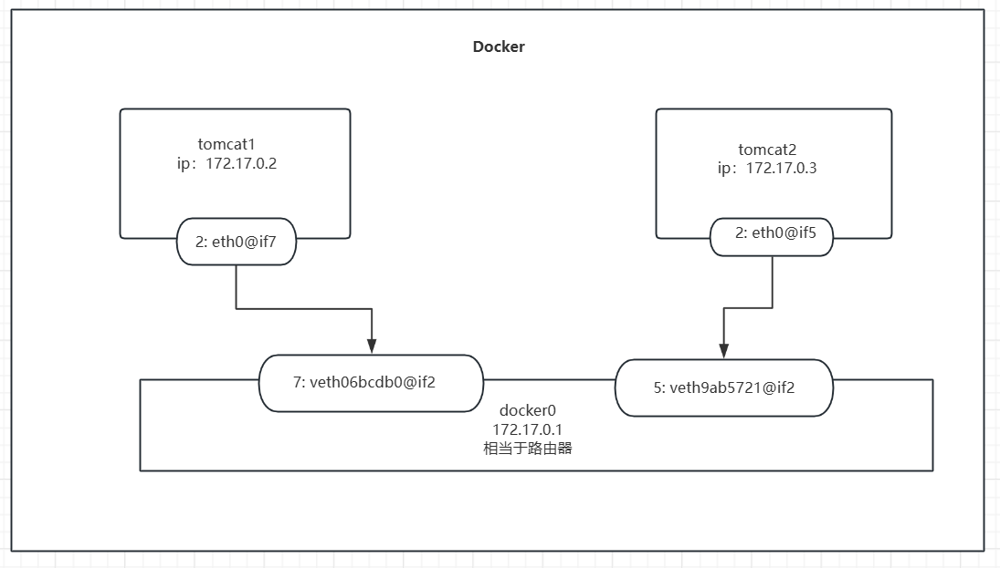
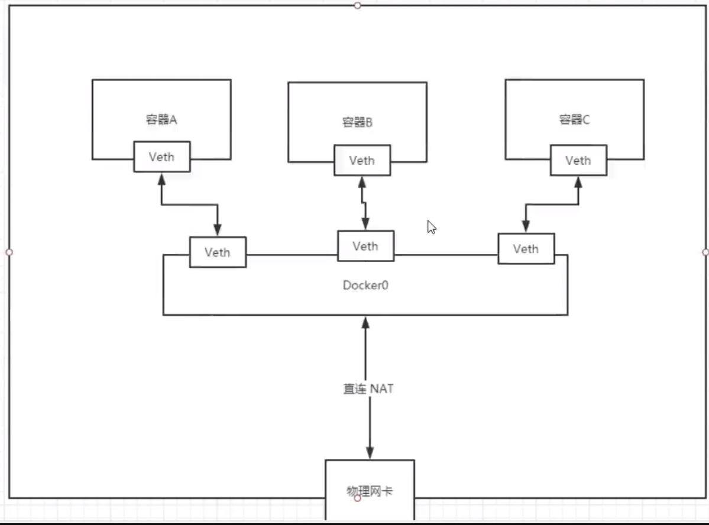

# Docker学习笔记

**compose之前属于狂神说笔记，之后全是自己的学习笔记**

## [强烈建议的学习文档](https://docs.docker.com/get-started/)

## 学习大纲

### 初级

- Docker 概述
- Docker 安装
- Docker 命令
  - 镜像命令
  - 容器命令
  - 操作命令

### 中级

- Docker 镜像
- 容器数据卷
- DockerFile 脚本
- Docker 网络原理
- IDE 整合 Docker

### 高级

- Docker Compose
- Docker Swarm
- 持续集成与部署 Jekins

## 起步

### Docker 应用场景

- 容器化技术
- 系统级别虚拟化技术
- 轻便、容器间隔离
- DevOps
- 一键运行
- 打包镜像，发布
- 便捷升级和扩、缩容
- 高效的计算资源利用
- 

### 文档

[官方文档](https://docs.docker.com/)

### 基本组成

#### 架构

.assets/架构.jpg)

### 名词解释

1. 镜像 **image**：类似于一个模板，可通过这个模板来创建容器服务，tomcat => docker run => tomcat 01 （容器服务）；通过这个镜像可重复创建多个容器。
2.  容器 **container**：Docker 利用容器技术，独立运行一个或一组通过镜像来创建的应用。容器具备启动、停止、删除等的基本命令；可理解为简易的 Linux 系统。 
3. 仓库 **repository**：存放镜像的地方。公有仓库：Docker Hub。国内访问需采取加速措施。

### [Debian 安装 Docker](https://docs.docker.com/engine/install/debian/)

### [卸载 Docker](https://docs.docker.com/engine/install/debian/#uninstall-docker-engine)

## Docker 原理

C-S架构，容器之间互相隔离，通过 Socket 进行通信。

### Docker 快于 VM 的原理

1. 比 VM 更少的抽象层
   
   .assets/区别.jpg)
2. docke 利用宿主机的内核， VM 需要 Guest OS

## [Docker 常用命令]([Use the Docker command line | Docker Documentation](https://docs.docker.com/engine/reference/commandline/cli/))

###  帮助命令

```shell
docker version	# docker 版本信息
docker info		# 显示 docker 系统信息
docker --help	# 帮助命令
docker stats	# 查看 docker 资源占用情况命令
docker system df # 查看镜像、容器、数据卷所占用的空间
```

### 镜像命令

#### docker images 展示镜像

> ‎默认值将显示所有顶级映像、其存储库和标记以及大小。‎`docker images`
>
> ‎Docker 映像具有中间层，可提高可重用性、降低磁盘使用率，并通过允许缓存每个步骤来加快速度。默认情况下不显示这些中间层。‎`docker build`
>
> ‎是图像及其所有父图像占用的累积空间。这也是映像时创建的 Tar 文件的内容所使用的磁盘空间。‎`SIZE``docker save`
>
> ‎如果一个映像具有多个存储库名称或标记，则该映像将被多次列出。这个单一的图像（可以通过其匹配来识别）只用完了列出的一次。‎`IMAGE ID``SIZE`

.assets/images.png)

#### docker search 搜索镜像

例如：`docker search mysql`。

.assets/搜索镜像.png)

#### [docker pull 下载镜像]([Docker Hub Container Image Library | App Containerization](https://hub.docker.com/))

`docker pull [选项] [Docker Registry 地址[:端口号]/]仓库名[:标签]`

不加 tag，默认下载 最新镜像.前往标题链接地址,确定适用版本.

.assets/拉取镜像.png)

#### docker rmi 删除镜像

>  docker remove image 的简写

 Options

| ‎名称，速记‎     | ‎Default | ‎描述‎                 |
| -------------- | ------- | -------------------- |
| `--force`‎,‎`-f` |         | ‎强制删除镜像‎         |
| `--no-prune`   |         | ‎不要删除未标记的父项‎ |

#### docker image ls 列出镜像

列出已经下载下来的镜像，`docker image ls`。

### 容器命令

> 有了镜像才能够创建容器

#### 新建容器并启动

```shell
docker run [options] image
# 参数说明
--name="Name"			指定容器名
-d						后台方式运行
-it						交互方式运行
-p						指定容器端口,常用 主机端口:容器端口(主机端口映射到容器端口)
-v 	主机目录:容器目录	   指定容器数据卷,将主机目录映射到指定的容器目录进行数据持久化和同步

docker run -it centos	#交互式启动并进入容器,-it 后可跟镜像id
# exit 从容器中退出
# 容器不停止推出 Ctrl + P + Q


```

#### docker ps 列出所有运行的容器

| 参数 | 描述                            |
| ---- | ------------------------------- |
| -a   | 列出正在运行的+历史运行过的容器 |
| -n=? | 最近创建的?个容器               |
| -q   | 只显示容器的编号                |

#### docker rm 删除容器

```shell
docker rm 容器id	# 删除指定容器,不能删除正在运行的容器,添加 -f 可强制删除
```

#### 启动和停止容器

```shell
docker start 容器id	#启动容器
docker restart 容器id	#重启容器
docker stop 容器id	#停止当前运行的容器
docker kill	容器id	#强制停止当前容器
```

### 常用其他命令

#### docker logs 打印日志

`docker logs -tf --tail 10 容器id`：打印正在运行容器的最新的10条日志

#### docker ps 查看容器内的进程信息

#### docker top 查看容器内的进程信息

`docker top 容器id`:查看相关的容器进程信息

#### docker inspect 查看容器的详细元数据

#### docker cp 文件拷贝到主机

拷贝是一个手动过程,未来可通过数据卷实现自动拷贝

用法:`docker cp 容器id:目录文件 宿主机目录位置`

示例:`docker cp 7acc78a184ab:/home/test.go /home`

### 进入当前正在运行的容器

#### `docker exec -it 容器id COMMAND`

.assets/进入容器.png)

进入容器后开启一个新的终端

#### `docker attach 容器id COMMAND`

​	docker attach 是 Docker 中一个非常有用的命令，它的作用是将本地的标准输入、输出和错误流连接（附加）到一个正在运行的容器上。你可以把它理解为：进入一个已经在运行的容器的“终端”或“控制台” ，就像你通过 SSH 登录到一台服务器一样。

​	实际上就是你进入容器就可以知道它正在干什么，进入正在执行的终端

### 总结

.assets/总结图.png)

## 实战练习

### docker 部署 Nginx

1. 搜索镜像
2. 下载镜像
3. 运行测试

```shell
# 搜索 Nginx 镜像
root@ALi:~# docker search nginx
NAME                              DESCRIPTION                                     STARS               OFFICIAL            AUTOMATED
nginx                             Official build of Nginx.                        16043               [OK]                
jwilder/nginx-proxy               Automated Nginx reverse proxy for docker con…   2104                                    [OK]
richarvey/nginx-php-fpm           Container running Nginx + PHP-FPM capable of…   819                                     [OK]
jc21/nginx-proxy-manager          Docker container for managing Nginx proxy ho…   301                                     
linuxserver/nginx                 An Nginx container, brought to you by LinuxS…   161                                     
tiangolo/nginx-rtmp               Docker image with Nginx using the nginx-rtmp…   148                                     [OK]
jlesage/nginx-proxy-manager       Docker container for Nginx Proxy Manager        147                                     [OK]
alfg/nginx-rtmp                   NGINX, nginx-rtmp-module and FFmpeg from sou…   112                                     [OK]
nginxdemos/hello                  NGINX webserver that serves a simple page co…   81                                      [OK]
privatebin/nginx-fpm-alpine       PrivateBin running on an Nginx, php-fpm & Al…   61                                      [OK]
nginx/nginx-ingress               NGINX and  NGINX Plus Ingress Controllers fo…   59                                      
nginxinc/nginx-unprivileged       Unprivileged NGINX Dockerfiles                  56                                      
nginxproxy/nginx-proxy            Automated Nginx reverse proxy for docker con…   33                                      
staticfloat/nginx-certbot         Opinionated setup for automatic TLS certs lo…   25                                      [OK]
nginx/nginx-prometheus-exporter   NGINX Prometheus Exporter for NGINX and NGIN…   22                                      
schmunk42/nginx-redirect          A very simple container to redirect HTTP tra…   19                                      [OK]
centos/nginx-112-centos7          Platform for running nginx 1.12 or building …   16                                      
centos/nginx-18-centos7           Platform for running nginx 1.8 or building n…   13                                      
bitwarden/nginx                   The Bitwarden nginx web server acting as a r…   12                                      
flashspys/nginx-static            Super Lightweight Nginx Image                   11                                      [OK]
mailu/nginx                       Mailu nginx frontend                            10                                      [OK]
webdevops/nginx                   Nginx container                                 9                                       [OK]
sophos/nginx-vts-exporter         Simple server that scrapes Nginx vts stats a…   7                                       [OK]
ansibleplaybookbundle/nginx-apb   An APB to deploy NGINX                          3                                       [OK]
wodby/nginx                       Generic nginx                                   1                                       [OK]
# 下载 Nginx 镜像
root@ALi:~# docker pull nginx
Using default tag: latest
latest: Pulling from library/nginx
a2abf6c4d29d: Pull complete 
a9edb18cadd1: Pull complete 
589b7251471a: Pull complete 
186b1aaa4aa6: Pull complete 
b4df32aa5a72: Pull complete 
a0bcbecc962e: Pull complete 
Digest: sha256:0d17b565c37bcbd895e9d92315a05c1c3c9a29f762b011a10c54a66cd53c9b31
Status: Downloaded newer image for nginx:latest
docker.io/library/nginx:latest
# 验证 Nginx 镜像是否下载成功
root@ALi:~# docker images
REPOSITORY          TAG                 IMAGE ID            CREATED             SIZE
nginx               latest              605c77e624dd        21 hours ago        141MB
mysql               latest              3218b38490ce        9 days ago          516MB
hello-world         latest              feb5d9fea6a5        3 months ago        13.3kB
centos              latest              5d0da3dc9764        3 months ago        231MB
# 新建容器并运行 Nginx,同时完成端口映射和命名
root@ALi:~# docker run --name first-Nginx -d -p 3000:80 nginx
12fe23e2bac31ebcce62e4fdfe8ae85108c2afa94a1c47e7ee77f99a0e590dba
root@ALi:~# docker ps
CONTAINER ID        IMAGE               COMMAND                  CREATED             STATUS              PORTS                  NAMES
12fe23e2bac3        nginx               "/docker-entrypoint.…"   3 seconds ago       Up 2 seconds        0.0.0.0:3000->80/tcp   first-Nginx
# 验证是否正确开启 Nginx, 以下为y
root@ALi:~# curl localhost:3000
<!DOCTYPE html>
<html>
<head>
<title>Welcome to nginx!</title>
<style>
html { color-scheme: light dark; }
body { width: 35em; margin: 0 auto;
font-family: Tahoma, Verdana, Arial, sans-serif; }
</style>
</head>
<body>
<h1>Welcome to nginx!</h1>
<p>If you see this page, the nginx web server is successfully installed and
working. Further configuration is required.</p>

<p>For online documentation and support please refer to
<a href="http://nginx.org/">nginx.org</a>.<br/>
Commercial support is available at
<a href="http://nginx.com/">nginx.com</a>.</p>

<p><em>Thank you for using nginx.</em></p>
</body>
</html>
```

## docker 镜像

### docker commit（慎用）

需要保存当前容器的状态,便可通过 commit 提交,来获得一个对象.

| 名称，速记‎       | ‎默认值 | ‎描述‎                                                       |
| ---------------- | ------ | ---------------------------------------------------------- |
| `--author`‎,‎`-a`  |        | ‎作者（例如，"John Hannibal Smith\<hannibal@a-team.com\>"）‎ |
| `--change`‎,‎`-c`  |        | ‎将 Dockerfile 指令应用于创建的映像‎                         |
| `--message`‎,‎`-m` |        | ‎提交消息‎                                                   |
| `--pause`‎,‎`-p`   | `true` | ‎在提交期间暂停容器‎                                         |

#### 正确使用方式

- 如果容器名是`two_tomcat`,正确的`docker commit` 命令应该是：

  ```shell
  docker commit -a mada -m 'what the hell' two_tomcat new_image_name
  ```

  这里 `new_image_name` 是你要创建的新镜像的名称。如果你想给镜像添加标签，可以后续使用 `docker tag` 命令，例如：

  ```shell
  docker tag new_image_name new_image_name:x.0
  ```

**注意事项：提交后与源容器不符合**

- **数据卷挂载不一致**：原容器可能挂载了数据卷，这些数据卷中的数据对容器的运行状态有影响。`docker commit`不会将数据卷中的数据包含到镜像中。例如，原容器是一个数据库容器，数据存储在挂载的数据卷中。提交镜像后，新容器启动时如果没有挂载相同的数据卷，容器内数据库将没有原有的数据，表现和原容器不同。
- **解决方法**：在启动新容器时，确保挂载相同的数据卷。假设原容器挂载了宿主机`/data/mysql`目录到容器内`/var/lib/mysql`目录

## 容器数据卷

如果数据都在容器中,一旦删除容器,数据也会丢失.**如何使数据持久化?**

为解决这个问题, Docker具备一个数据共享技术进行容器数据的持久化和同步操作.

### 使用数据卷

#### 直接使用命令进行挂在`-v`

```shell
#语法
docker run -it -v 主机目录:容器目录
#MYSQL示例
docker run -d -p 3310:3306  -v /home/mysql/conf:/etc/mysql/conf.d -v /home/mysql/data:/var/lib/mysql -e MYSQL_ROOT_PASSWORD=mysql2022 --name="mysql01" mysql
```

解释:

1. `-v`可使用多次,挂载多个目录
2. `-e`配置环境参数,`MYSQL_ROOT_PASSWORD=centos-2022`就是配置 MySQL的 root 密码为`centos-2022`
3. `-p 3310:3306`将主机的3310端口映射到该容器的3306端口

#### 数据卷容器

##### 基本使用

```bash
docker volume [选项]
#选项
create # 创建数据卷
inspect #查看数据卷元数据
ls #查看数据卷列表
prune #删除所有未使用的卷
rm #删除数据卷
```

###### 示例：从自定义到删除

```shell
#创建自定义一个容器数据卷
docker volume create edc-tomcat-vol
#查看所有容器数据卷
docker volume ls
#查看指定容器卷的详细信息
docker volume inspect edc-tomcat-vol
#删除数据卷
docker volume rm edc-tomcat-vol
```

###### 指定容器数据卷，tomcat为例：

```shell
docker run -d -it --name=edc-tomcat -p
8080:8080 -v edc-tomcat-
vol:/usr/local/tomcat/webapps tomcat
```

> 注意：
>
> -v 代表挂载数据卷，这里使用自定数据卷 edc-tomcat-vol，并且将数据卷挂载到 /usr/local/tomcat/webapps 。如果没有通过-v指定，那么Docker会默认帮我们创建匿名数据卷进行映射和挂载
>
> 数据卷在宿主机上的实际路径为：`/var/lib/docker/volumes/my-data-volume/_data`

##### 同步共享

**使用 `docker run --volumes-from` 命令开启一个新容器同时挂载已挂载于容器中的数据卷以实现数据卷共享和同步**.

```shell
docker run -it --name docekr02 --volumes-from docker01 wenbin/dockerfile01:1.0
```

帮助容器之间配置信息传递、数据持久化和同步。数据卷容器的生命周期持续到无容器使用该数据卷。

- **所有的docker容器内的卷，没有指定目录的情况下都是在 `/var/lib/docker/volumes/xxxx/data`**
- 我们通过具名挂载可以方便的找到我们的一个卷，大多数情况下在使用的具名挂载

## DockerFile

DockerFile就是构建Docker镜像的脚本文件。

### 构建步骤

1. 编写 dockerfile 文件

   1. 命名方式

   >  **文件名**
   >
   > - **使用 Dockerfile**：最常见且推荐的方式是直接命名为 `Dockerfile`（注意大小写，在 Linux 系统中一般为大写开头）。当你使用 `docker build` 命令构建镜像时，在包含该文件的目录下执行命令，Docker 会默认查找名为 `Dockerfile` 的文件来构建镜像。
   >
   >   ```shell
   >   docker build -t my - image.
   >   ```
   >
   > - **指定文件名**：如果你想使用自定义的文件名，比如 `MyAppDockerfile`，可以在 `docker build` 命令中使用 `-f` 选项指定文件名。示例如下：
   >
   >   ```shell
   >   docker build -f MyAppDockerfile -t my - image.
   >   ```
2. docker build 构建成为一个镜像
3. docker run 运行镜像
4. docker push 发布镜像（可选）

简单脚本示例:

```dockerfile
# 创建dockerfile文件,文件名建议带有dockerfile
# 脚本中的指令大写
FROM centos
# 挂载 "/volumes1", "/volumes2" 两个数据卷
VOLUME ["/volumes1", "/volumes2"]
CMD echo "----end----"
CMD /bin/bash
```

.assets/dockerfile01.png)

检查一下,发现容器构建成功:

.assets/dockerfile02.png)

再使用`docker run`命令运行容器.

### 指令

#### 基础知识

1. 每个指令必须是大写
2. 从上到下顺序执行
3. `#`注释
4. 每个指令都会创建提交一个镜像层
5. 面向开发者

#### 命令

| 命令       | 描述                                                         |
| ---------- | ------------------------------------------------------------ |
| FROM       | 基础镜像，一切从这里开始                                     |
| MAINTAINER | 镜像作者、维护者，名字+邮箱(新版本建议改成 LABEL maintainer “author \<email@163.com\>”) |
| RUN        | 镜像构建时需要运行的命令                                     |
| VOLUME     | 镜像挂载的目录                                               |
| EXPOSE     | 对外暴露的端口配置                                           |
| CMD        | 指定容器启动时要运行的命令，仅最后一个生效，可以追加命令     |
| ENTRYPOINT | 指定容器启动时要运行的命令，可以追加命令                     |
| ONBUILD    | 当构建一个被继承的 dockerfile 时会运行                       |
| COPY       | 类似 ADD， 将文件拷贝到镜像中                                |
| ENV        | 构建时设置的环境变量                                         |

.assets/dockerfile724.png)

.assets/dockerfile891.png)

### dockerfile 实战

****

##### CMD命令

- 数组方式构建命令和shell命令构建命令是不一样的
- **数组方式**
  - `CMD ["ls","-a"]`
    - 这种格式直接执行指定的可执行文件及其参数。例如 `CMD ["ls", "-a"]`，Docker 会直接调用 `ls` 程序并传递 `-a` 参数。它绕过了 shell 环境，直接在容器内的进程空间中启动进程。这使得命令的执行更加直接，也更符合预期的程序执行逻辑
  - 可以只写一个参数，例如：`CMD ['-a']`,其行为取决于镜像中是否设置了 ENTRYPOINT
  - **如果有设置 ENTRYPOINT ，CMD的内容会作为参数传递给ENTRYPOINT**
  - ### **核心区别对比**
  
    | **对比项**   | **CMD**                                    | **ENTRYPOINT**                                |
    | ------------ | ------------------------------------------ | --------------------------------------------- |
    | **命令覆盖** | 可被 `docker run` 后的命令覆盖             | 不可被覆盖，后续命令会作为参数传递            |
    | **默认行为** | 提供默认命令或参数                         | 定义容器启动时的主命令                        |
    | **常用场景** | 为容器提供默认执行命令                     | 让容器像一个可执行程序（如 `nginx`、`mysql`） |
    | **配合方式** | 可单独使用，或为 `ENTRYPOINT` 提供默认参数 | 通常与 `CMD` 结合使用，接收参数               |
- **shell方式**
  - `CMD ls -a`
    - 这种格式实际上是在容器内通过 `/bin/sh -c` 来执行命令。例如 `CMD ls -a`，Docker 会启动一个 `/bin/sh` 进程，并在这个 shell 环境中执行 `ls -a` 命令。这意味着命令会受到 shell 环境的各种规则影响，例如支持通配符扩展（如 `ls *.txt`）、管道操作（如 `ls | grep.txt`）等。

##### 注意事项

```shell
docker build -f 指定要运行的dockerfile目录 -t 指定名字:版本 path#(最后一个是指定上下文目录，比如：ADD 宿主机上src目录 容器内目录 )
#src目录需要在上下文目录中 --. 代表的是当前目录下--
#如果不指定 -f 那么就是默认情况在当前目录下执行
```

**Docker 构建上下文是一个目录路径** ，你在执行 `docker build` 命令时指定这个目录，Docker 会： 

- **把这个目录下的所有文件打包发送给 Docker 守护进程（即：后台服务）。**
- **在构建过程中，Dockerfile 中的 `COPY` 和 `ADD` 指令只能访问这个上下文目录里的内容。**
- **构建上下文由命令行最后一个参数决定** （如 `.`、`/tmp/myapp`），而 **`-f` 只是告诉 Docker 到哪找 Dockerfile** 。 

#### docker push

##### push至dockerhub

**要确定你可以登录DockerHub**

```shell
docker login -u 用户名 -p 密码

# 会发现push不上去，因为如果没有前缀的话默认是push到 官方的library
# 解决方法：
# 第一种 build的时候添加你的dockerhub用户名，然后在push就可以放到自己的仓库了
$ docker build -t 用户名/镜像名:版本号 .

# 第二种 使用docker tag #然后再次push
$ docker tag 容器id 用户名/镜像名:版本号 #然后再次push

docker push 用户名/镜像：版本号
```

#### 发布到阿里云上 

**官网教程详细**

## Docker 网络

#### 两个容器时如何相互联通的

**先查看没有容器之前的网络接口信息**

- lo
  - 接口名称，`lo` 代表回环接口，用于本地网络通信
- ens33
  - 以太网接口名称
- docker0
  - 以太网接口名称，不同系统可能命名不同，如 `enp0s3` 等。
  - 也是虚拟网桥

```bash
motor@motor:~/dockerfile$ ip addr

1: lo: <LOOPBACK,UP,LOWER_UP> mtu 65536 qdisc noqueue state UNKNOWN group default qlen 1000
    link/loopback 00:00:00:00:00:00 brd 00:00:00:00:00:00
    inet 127.0.0.1/8 scope host lo
       valid_lft forever preferred_lft forever
    inet6 ::1/128 scope host noprefixroute 
       valid_lft forever preferred_lft forever
2: ens33: <BROADCAST,MULTICAST,UP,LOWER_UP> mtu 1500 qdisc fq_codel state UP group default qlen 1000
    link/ether 00:0c:29:53:b2:84 brd ff:ff:ff:ff:ff:ff
    altname enp2s1
    inet 192.168.31.91/24 brd 192.168.31.255 scope global dynamic noprefixroute ens33
       valid_lft 40664sec preferred_lft 40664sec
    inet6 fe80::20c:29ff:fe53:b284/64 scope link 
       valid_lft forever preferred_lft forever
3: docker0: <NO-CARRIER,BROADCAST,MULTICAST,UP> mtu 1500 qdisc noqueue state DOWN group default 
    link/ether 9a:ae:c7:69:88:83 brd ff:ff:ff:ff:ff:ff
    inet 172.17.0.1/16 brd 172.17.255.255 scope global docker0
       valid_lft forever preferred_lft forever
```

创建了两个容器之后

```shell
motor@motor:~/dockerfile$ docker run -P --name tomcat1 -d tomcat
93eb9759631c75c86a40e8fad7e775b04ed7dd92b973a95380b355eb8be5f24b

motor@motor:~/dockerfile$ docker run -P --name tomcat2 -d tomcat
710b94d437353a967fc9387d4f68ba2c7658c1221fff2cd01cc374556e0391d5
```

**多了两个网络接口**

tomcat1:`4: veth2dfc192@if2`

tomcat2:` 5: veth9ab5721@if2`

```shell
motor@motor:~/dockerfile$ ip addr
1:.....
.......
......#忽略之前的内容
4: veth2dfc192@if2: <BROADCAST,MULTICAST,UP,LOWER_UP> mtu 1500 qdisc noqueue master docker0 state UP group default 
    link/ether 6a:96:4d:22:be:5b brd ff:ff:ff:ff:ff:ff link-netnsid 0
    inet6 fe80::6896:4dff:fe22:be5b/64 scope link 
       valid_lft forever preferred_lft forever
5: veth9ab5721@if2: <BROADCAST,MULTICAST,UP,LOWER_UP> mtu 1500 qdisc noqueue master docker0 state UP group default 
    link/ether ee:61:84:fc:ca:cd brd ff:ff:ff:ff:ff:ff link-netnsid 1
    inet6 fe80::ec61:84ff:fefc:cacd/64 scope link 
       valid_lft forever preferred_lft forever
```

进入容器查看里面的网络接口

```shell
#######
#Tomcat1
#######
root@93eb9759631c:/usr/local/tomcat# ip addr
#回环地址不重要
#网络接口信息
2: eth0@if7: <BROADCAST,MULTICAST,UP,LOWER_UP> mtu 1500 qdisc noqueue state UP group default 
    link/ether b6:b0:db:19:a4:f5 brd ff:ff:ff:ff:ff:ff link-netnsid 0
    inet 172.17.0.2/16 brd 172.17.255.255 scope global eth0
       valid_lft forever preferred_lft forever

#######
#Tomcat2
#######
root@710b94d43735:/usr/local/tomcat/webapps# ip addr
#回环地址，不重要
......
#网卡信息
2: eth0@if5: <BROADCAST,MULTICAST,UP,LOWER_UP> mtu 1500 qdisc noqueue state UP group default 
    link/ether 2e:e8:c5:d8:f5:2b brd ff:ff:ff:ff:ff:ff link-netnsid 0
    inet 172.17.0.3/16 brd 172.17.255.255 scope global eth0
       valid_lft forever preferred_lft forever
```

**不难发现容器内的网络接口信息是与宿主机上多出的两个网络接口信息是相对应的**

**tomcat1:`7: veth06bcdb0@if2`** ---------------- **2: eth0@if7**（2对应7,7对应2）

**tomcat2:` 5: veth9ab5721@if2`** ----------------- **2: eth0@if5**（2对应5,5对应2）

它们之间的相互通信是通过`veth pair`技术实现的，上面的情况就是这样的

​	**veth pair 是一种在 Linux 系统中用于连接两个网络命名空间的特殊网络设备对。每个 veth pair 包含两个虚拟网络接口，它们就像一根双头线缆的两端一样工作，一个端点上的数据发送会被另一个端点接收，反之亦然。**

**上面的情况就是对应的虚拟网络接口，通过这连个网络接口就可以进行相互联系，如下图所示：**




结论：**tomcat1和tomcat2共用一个路由器，docker0**。

**所有的容器不指定网络的情况下，都是docker0路由的，docker会给我们的容器分配一个默认的可用ip。**



#### 基本四种模式

##### bridge

- **描述** ：这是 Docker 的默认网络模式。
- 行为 ：
  - **容器启动时会自动分配一个私有 IP 地址。**
  - 所有使用 bridge 模式的容器默认可以通过内网互通。
  - 容器对外访问时，会通过宿主机的 IP 做 NAT 转换。
- 使用场景 ：
  - 多个容器部署在同一个宿主机上，需要互相通信。
  - 开发测试环境常用。

```shell
docker run --network host ...
```

##### host

- **描述** ：容器不使用独立的网络命名空间，直接使用宿主机的网络栈。
- 行为 ：
  - **容器没有自己的 IP 地址，共享宿主机的 IP 和端口。**(相当于宿主机上的一个服务，通过端口来访问，ip还是宿主机上的ip)
  - 容器可以直接使用宿主机的网络接口。
- 优点 ：
  - 性能更好，没有 NAT 或桥接带来的开销。
- 缺点 ：
  - 安全性较低，网络隔离差。
- 使用场景 ：
  - 对网络性能要求高，如高性能服务或监控工具。

```shell
docker run --network host ...
```

##### none

- 描述 ：禁用所有网络功能。
- 行为 ：
  - **容器拥有自己的网络命名空间，但没有任何网络配置（只有 lo 接口）。**
- 使用场景 ：
  - 不需要网络通信的容器，如批处理任务。
    需要自定义网络配置的高级用户。

##### container

- **描述** ：新容器与一个已存在的容器共享网络命名空间。
- 行为 ：
  - **新容器不会创建自己的网络接口，而是共享指定容器的网络栈。**
  - **两个容器共享相同的 IP 和端口空间。**
- 使用场景 ：
  - 辅助容器需要与主容器共享网络时，例如 sidecar 架构。

#### 通过服务名来联通

思考一个场景：我们编写了一个微服务，database url=ip: 项目不重启，数据ip换了，我们希望可以处理这个问题，可以通过名字来进行访问容器？

##### **--link**

本质就是在hosts配置中添加映射，现在使用Docker已经不建议使用–link了！自定义网络，不适用docker0！docker0问题：不支持容器名连接访问！

```shell
#再启动一个容器让其link tomcat2，然后看看是否能通过服务名ping通
docker run -P -d --name tomcat3 --link tomcat2 tomcat

#进入容器之后开始 ping tomcat2 如果没有 iputils-ping，可自行安装(ubuntu:apt)
root@83624b1a107b:/usr/local/tomcat# ping tomcat2
PING tomcat2 (172.17.0.3) 56(84) bytes of data.
64 bytes from tomcat2 (172.17.0.3): icmp_seq=1 ttl=64 time=0.131 ms
64 bytes from tomcat2 (172.17.0.3): icmp_seq=2 ttl=64 time=0.098 ms
64 bytes from tomcat2 (172.17.0.3): icmp_seq=3 ttl=64 time=0.043 ms
#发现可以ping通

#然后查看配置文件，发现对其进行了ip域名的映射，所以可以直接ping通，但是呢tomcat2无法ping通tomcat3，因为它没绑定
root@83624b1a107b:/usr/local/tomcat# cat /etc/hosts
127.0.0.1       localhost
::1     localhost ip6-localhost ip6-loopback
fe00::  ip6-localnet
ff00::  ip6-mcastprefix
ff02::1 ip6-allnodes
ff02::2 ip6-allrouters
172.17.0.3      tomcat2 710b94d43735
172.17.0.4      83624b1a107b
```

### 自定义网络模式

**`docker network --help`**

- **创建一个网络**

  - 也会创建一个虚拟网桥，通信到外部网络时，也会通过此网桥进行，并不会通过docker0这个网桥

  - ```shell
    docker network create --driver 指定模式 --subnet 指定网络地址范围 --gateway 指定网关 自定义网络名 
    ```

- **创建容器，让它们处于自己创建的网络之中**

  ```shell
  docker run -d -P --name tomcat4/5 --network <网络名称或ID> [其他参数] <镜像名>
  ```

- **相互ping通,无法ping通**

  ```shell
  root@93eb9759631c:/usr/local/tomcat# ping tomcat4
  ping: tomcat4: Name or service not known
  ```

**对于不同网络之间的容器如何联系？**

- **通过 connect 进行操作**

#### 常用选项说明

**不添加任何选项就是默认分配**

| 选项                      | 说明                                             |
| ------------------------- | ------------------------------------------------ |
| `--alias strings`         | 在这个网络中为容器设置一个或多个别名（DNS 名称） |
| `--ip string`             | 为容器在这个网络中指定一个固定的 IPv4 地址       |
| `--ip6 string`            | 为容器在这个网络中指定一个固定的 IPv6 地址       |
| `--link list`             | 添加对另一个容器的链接（不推荐使用）             |
| `--link-local-ip strings` | 为容器添加一个链路本地地址（如`169.254.x.x`）    |
| `--driver-opt strings`    | 传递给网络驱动的自定义选项                       |
| `--gw-priority int`       | 设置该网络接口的网关优先级（正数越高越优先）     |

将tomcat1加入到创建的网络mynet中，在测试它是否可以与tomcat4进行ping通

```shell
motor@motor:~$ docker network connect mynet tomcat1#查看mynet网络详细信息,发现tomcat1加入到了网络之中
motor@motor:~$ docker network inspect mynet 
[
......
......
        "Containers": {
            "93eb9759631c75c86a40e8fad7e775b04ed7dd92b973a95380b355eb8be5f24b": {
                "Name": "tomcat1",
                "EndpointID": "1e0ed660d9a29637cf4fa74b2b141f316f28a772f372f2fefe71069a8f13925a",
                "MacAddress": "8a:b3:02:85:b5:b3",
                "IPv4Address": "172.18.1.4/24",
                "IPv6Address": ""
            },
            "fa8eb1207333ab298e995eb4337e027d6f921171942e06388d5227988b385418": {
                "Name": "tomcat5",
                "EndpointID": "158e5de7d4473ec5f19c02758d52d90934f45fb72ce0cfc7eda0995dcdffd3af",
                "MacAddress": "da:41:56:db:03:f0",
                "IPv4Address": "172.18.1.3/24",
                "IPv6Address": ""
            },
            "fceeac3b1eae5b9e41219ccf827a07d83bb25845737544ef2637bcc0e69ecb7d": {
                "Name": "tomcat4",
                "EndpointID": "caf92f8f1c3cc655990538b4ba4f49416bf18c33306f8aa37d1d907f74ed5b78",
                "MacAddress": "92:2f:49:33:05:72",
                "IPv4Address": "172.18.1.2/24",
                "IPv6Address": ""
            }
        },
        "Options": {},
        "Labels": {}
    }
]
#结果很明显，完全可以ping通，因为它们已经在一个网络之中了
root@93eb9759631c:/usr/local/tomcat# ping tomcat4
PING tomcat4 (172.18.1.2) 56(84) bytes of data.
64 bytes from tomcat4.mynet (172.18.1.2): icmp_seq=1 ttl=64 time=0.115 ms
64 bytes from tomcat4.mynet (172.18.1.2): icmp_seq=2 ttl=64 time=0.129 ms
64 bytes from tomcat4.mynet (172.18.1.2): icmp_seq=3 ttl=64 time=0.134 ms
```

**注意：tomcat2是无法ping通的，因为它没加入到这个网络之中，tomcat5也可以ping通tomcat1，因为它们同处于一个网络之中**

- **部署集群**

- **项目构建成docker镜像**

  - 做好项目，构建dockerfile，然后直接`docker build ...`即可

  - SpringBoot微服务打包Docker镜像

    1、构建SpringBoot项目

    2、打包运行

    `mvn package`

    3、编写dockerfile

    ```dockerfile
    FROM java:8
    COPY *.jar /app.jar
    CMD ["--server.port=8080"]
    EXPOSE 8080
    ENTRYPOINT ["java","-jar","app.jar"]
    ```

    ​	创建一个dockerfile文件，放入上面的代码，把jar和文件上传到xshell

    4、构建镜像

    ```dockerfile
    # 1.复制jar和DockerFIle到服务器
    # 2.构建镜像
    $ docker build -t xxxxx:xx  .
    ```

    5、发布运行

    以后我们使用了Docker之后，给别人交付就是一个镜像即可

# Docker Compose and Swarm

> 终极目的：**如何在多个服务器上自动化地部署、管理、调度和维护容器化的应用？** 

最基本的学习测试：

- 根据自定义网络的内容使用compose创建一下

## docker compose

**单机部署使用它**

 	**一句话总结它到底能干什么**：**在没有 Docker Compose 之前，你需要用很多条命令去分别管理每个容器、网络、挂载点等；而有了 Docker Compose 后，你可以通过一个结构清晰的 YAML 文件统一管理整个应用的所有服务，简化了部署、调试和协作。** 

### 大概框架

从**整体框架角度**，简单但清晰地讲一下 **`docker-compose.yml` 文件中最核心的内容和结构**，让你快速掌握它的“骨架”。

---

#### `docker-compose.yml` 的核心作用

> 它是一个 **YAML 格式的配置文件**，用来定义你的应用所需要的多个容器服务（如 Web、数据库、缓存等），以及它们之间的关系（网络、挂载、端口、依赖等）。

一句话：
**你用它告诉 Docker Compose：“我这个应用需要哪些服务？每个服务怎么运行？”**

---

####  主要组成部分（框架结构）

**从从 Docker Compose v2 开始，docker-compose.yml 文件中的 version: 字段已经不再需要了！可以不写 **

一个典型的 `docker-compose.yml` 文件主要包括以下几个部分：

```yaml
#version: '3.8'   # 指定 compose 文件的版本
#版本已经可以不写了

services:        # 定义你要运行的服务（容器）
  web:           # 服务名（比如 web 服务）
    image: nginx:latest
    ports:
      - "80:80"
    networks:
      - mynet

  db:            # 另一个服务（比如数据库）
    image: mysql:5.7
    environment:
      MYSQL_ROOT_PASSWORD: rootpass
    volumes:
      - dbdata:/var/lib/mysql
    networks:
      - mynet

volumes:         # 定义数据卷（用于持久化数据）
  dbdata:

networks:        # 定义自定义网络
  mynet:
    driver: bridge
```

---

##### 几个最核心的概念（不需要记细节，先了解大概）

| 概念              | 说明                                                    |
| ----------------- | ------------------------------------------------------- |
| `version`         | 指定 Docker Compose 文件格式的版本（一般选 `'3.8'` 等） |
| `services`        | 最关键的部分，定义你要运行的所有容器服务                |
| `image` / `build` | 每个服务可以使用现成镜像，或自己构建（通过 Dockerfile） |
| `ports`           | 容器端口映射到宿主机上（如 `"8080:80"`）                |
| `volumes`         | 数据持久化，把宿主机目录或命名卷挂载进容器              |
| `environment`     | 设置环境变量（常用于配置数据库密码等）                  |
| `networks`        | 自定义网络，让服务之间能互相通信                        |
| `depends_on`      | 控制启动顺序（比如 Web 要等数据库先启动）               |

---

##### 举个类比帮助理解

你可以把 `docker-compose.yml` 想象成一个：

> **“应用部署说明书”**

就像你在组装一台电脑：

- CPU、内存、硬盘 = `image`, `volumes`
- 主板上的插槽、连接方式 = `networks`
- 各个部件安装顺序 = `depends_on`
- 外设接口设置 = `ports`

而 `docker-compose up` 就是按下“开机键”，自动帮你完成所有安装配置！

---

####  总结一句话

> **Docker Compose 最核心的东西就是一个 YAML 文件，里面定义了多个服务（容器）、它们使用的镜像、挂载、端口、网络等信息，让你一键启动整个应用环境。**

## Docker Compose 文件的标准结构

**下面的东西只助于了解个大概是怎么回事，想真正学习还得去官网进行学习**

例如：基础结构可以分为

- **版本和名称顶级元素**
- **服务顶级元素**
  - 服务顶级元素下的都是属性
    - 属性下面全是属性选项
- **网络顶级元素**
- **卷顶级元素**
- **配置顶级元素**
- **Secrets顶级元素**等等，需要查看对应元素就可以去官网查询

**compose适合单机部署，不适合集群，集群还是得使用docker swarm 或者是 K8s**

一个典型的 `docker-compose.yml` 文件的顶级字段如下：

```yaml
services: #顶级元素
  web: 
    ...
  db:
    ...

volumes: #卷顶级元素
  mydata:

networks: #网络顶级元素
  frontend:
  backend:

configs: #配置顶级元素
  appconfig:

secrets:
  dbpassword:
```

| 字段       | 描述                                |
| ---------- | ----------------------------------- |
| `services` | 必须的，定义你要运行的服务（容器）  |
| `volumes`  | 可选，定义命名卷，供服务挂载使用    |
| `networks` | 可选，定义自定义网络，供服务加入    |
| `configs`  | 可选，用于 Swarm 模式下管理配置文件 |
| `secrets`  | 可选，用于 Swarm 模式下管理敏感信息 |

#### 除了service之外，其他顶级元素的作用

###### **资源共享**

```yaml
services:
  web:
    networks:
      - appnet

  api:
    networks:
      - appnet

networks:
  appnet:
```

###### **统一配置和管理**

你可以在顶层一次性定义网络类型、子网、IP 范围等高级参数：

```yaml
networks:
  mynet:
    driver: bridge
    ipam:
      config:
        - subnet: 172.20.0.0/24
```

##### **区分“资源定义”和“服务定义”**

- `services`：描述的是“我要运行什么服务”
- `networks`, `volumes`：描述的是“我有哪些基础设施”

#### **隐式使用默认网络或匿名卷**

如果你不显式声明 `networks` 或 `volumes`，Docker 默认也会为你创建一些资源：

- 所有服务默认加入一个默认桥接网络 `<projectname>_default`
- 使用 `- ./data:/data` 这种方式挂载目录时，不会创建命名卷，但这种方式不利于管理和复用。

##### 默认情况下会如何操作

```yaml
networks:
  frontend:
  backend:
```

- 像上面那样只写了名字，没有指定任何参数 ，Docker Compose 会使用 默认配置 来创建这些网络：
  - 使用默认驱动：bridge
  - 自动分配子网和网关（由 Docker 的 IPAM 自动管理）
    容器可以互相通信（在同一个网络内）

### 基础语法

Docker Compose 的 compose.yaml 文件语法主要包括以下结构：

- 顶层通常有 services、volumes、networks 等部分。
- services 下定义每个服务（容器），可以指定 image、build、ports、volumes、environment 等配置项。

```yaml
services:
  frontend:
    image: example/webapp
    ports: 
      - "443:8043"  #短语法的写法
    networks:
      - front-tier
      - back-tier
    configs:
      - httpd-config
    secrets:
      - server-certificate

  backend:
    image: example/database
    volumes: #db-data是数据卷名，不用写上具体的路径，系统自然会自动帮你写上，不懂请看前面的数据卷名使用
    #想知道具体的容器内某些文件的目录，可以在官方镜像的默认路径说明哪里获取，如果没有，可以去github-docker仓库中查看对应的dockerfile文件
      - db-data:/etc/data
    networks:
      - back-tier

volumes:
  db-data:

configs:
  httpd-config:
    external: true

secrets:
  server-certificate:
    external: true

networks:
  front-tier: {}
  back-tier: {}
```

##### 具体说明

- 有些字段（如 `environment`、`ports`）既支持映射（`xxxx: value`）也支持列表（`xxxx: - value`）写法，具体支持哪种写法请参考官方文档。例如，`environment` 既可以写成键值对，也可以写成列表。

- 有些字段（如 `secrets`、`volumes`）在服务下只能用列表写法（`- value`），而在顶层定义时用映射写法（`xxxx: value`）[Compose file reference](https://docs.docker.com/compose/intro/compose-application-model/)、[Compose file secrets reference](https://docs.docker.com/reference/compose-file/services/#secrets)。

- **关于命名**

  - 当你使用 Docker Compose 启动服务时，**Docker 会根据你的项目名称和配置文件中的服务名自动生成容器名称** 。
    如果你设置了自定义网络名为 `tomcat1`，这只是网络的名字，**不是服务或容器的名称** 。

    ```shell
    services:
      tomcat1:
        image: tomcat:latest
        container_name: my-tomcat-container   # 如果没有设置这一行，就会自动生成名字
    ```

### 实例

#### 标准的文档

**此文档是根据上文中自定义网络的一系列操作而出的，使用compose的方式进行操作会更方便，对于网络块，最好使用自定义网络或者docker compose默认创建的网络，不要使用docker原本的网络**

- 在一个目录中定义一个 compose—test目录

- 编写文件 compose.yml

  ```yaml
  services:
    tomcat1:
      image: iputils_tomcat:1.0
      ports: 
        - "80" # 只指定容器端口80，主机端口会随机分配
      networks:
        - default # 加入 Docker-compose 默认的 bridge 网络
        
    tomcat2:
      image: iputils_tomcat:1.0
      ports:
        - "80" # 只指定容器端口80，主机端口会随机分配
      networks:
        - default # 加入 Docker-compose 默认的 bridge 网络,docker-compose会自定义一个网络
        - mynet2 #加入自定义的网络中
  
    tomcat3:
      image: iputils_tomcat:1.0
      ports:
        - "80" # 只指定容器端口80，主机端口会随机分配
      networks:
        - mynet2
  
    tomcat4:
      image: iputils_tomcat:1.0
      ports:
        - "80" # 只指定容器端口80，主机端口会随机分配
      networks:
        - mynet2
  
  #详细选项可以去官网进行查看学习，这里不做过多的赘述
  networks:
    mynet2:
      driver: bridge
      ipam:
        config:
          - subnet: 172.26.1.0/24
            gateway: 172.26.1.1 
              #subnet 和 gateway 都属于同一个配置对象，符合 Compose 文件规范。如果你将 gateway 单独写成一个列表项，会导致配置无效或报错,去掉 - 
  ```

- 启动

  ```shell
  docker compose up -d #后台启动
  #不切换目录进行操作
  docker compose -f /path/to/docker-compose.yml up
  ```

- 停止

  - **使用 `docker compose down` 命令时，通常需要在包含 `docker-compose.yml` 文件的目录下执行** ，除非你通过 `-f` 参数显式指定了其他位置的配置文件。

  ```shell
  #停止（Stop）容器： 它会向 Compose 文件中定义的所有正在运行的服务发送 SIGTERM 信号（终止信号），尝试优雅地停止这些容器。如果容器在超时时间内没有停止，Docker 会发送 SIGKILL 信号（强制终止）。
  
  #停止和清理由 docker compose up 命令创建的资源的工具。它会将你的应用程序“拆除”下来。
  motor@motor:~/Compose/test1$ docker compose down 
  [+] Running 6/6
   ✔ Container test1-tomcat1-1  Removed                                                                              0.5s 
   ✔ Container test1-tomcat2-1  Removed                                                                              0.7s 
   ✔ Container test1-tomcat3-1  Removed                                                                              0.6s 
   ✔ Container test1-tomcat4-1  Removed                                                                              0.6s 
   ✔ Network test1_default      Removed                                                                              0.4s 
   ✔ Network test1_mynet2       Removed                                                                             0.2s 
  ```

#### **注意点：**

##### networks选项注意点

​	在 Docker Compose 或 Docker 网络配置中，`subnet` 用于定义整个网络的地址范围，而 `ip_range`（IP 分配范围）用于指定从 `subnet` 中分配给容器的一个子集 IP 范围。
是否需要同时定义，取决于你的需求：

- 如果你只定义了 `subnet`，Docker 会从整个子网范围内分配 IP 给容器。
- 如果你还定义了 `ip_range`，Docker 只会从 `ip_range` 指定的范围内分配 IP 给容器，通常用于限制或管理容器可用的 IP 地址段。

##### 关于 `-deafault`属性选项

​	在 `docker-compose` 中，当你看到类似 `- default` 的网络声明时，它指的是 Docker Compose 为你的整个项目自动创建的**一个自定义的 `bridge` 网络**，而不是直接指代底层的 `docker0` 网络。

##### Docker Compose 自动创建网络

​	**当你使用 `docker-compose` 启动服务，并且没有在 `docker-compose.yml` 文件中明确定义任何网络时，Docker Compose 会自动为你的项目创建一个默认网络。**

​	**Docker Compose 的设计旨在简化网络配置。如果你不明确指定，它会自动为你的项目设置一个专用的 `bridge` 网络，并将所有服务连接到该网络，从而实现服务之间的无缝通信。**

## Docker Swarm

​	**它将多个Docker宿主机（物理机或虚拟机）聚合成一个虚拟的、统一的“巨型Docker引擎”。在这个集群上，你可以部署、管理和扩展你的Docker容器化应用，而无需关心它们具体运行在哪台机器上。10台机器以下时使用即可**

### Swarm 的核心概念

1. **节点 (Node)：**
   - Swarm集群中的每个Docker主机都被称为一个**节点**。
   - **管理节点 (Manager Node)：** 负责集群的管理和编排任务。它维护Swarm的状态、处理API请求、调度服务任务、并进行服务发现。一个Swarm集群可以有多个管理节点，以实现高可用（通常是奇数个，如3或5个，以避免“脑裂”）。
   - **工作节点 (Worker Node)：** 负责运行实际的容器（任务）。它们接收管理节点下发的任务，并向管理节点报告任务状态。工作节点不参与集群的管理。
2. **服务 (Service)：**
   - 服务是你希望在Swarm集群中运行的应用程序或任务的定义。它定义了：
     - 使用的**Docker镜像** (e.g., `nginx:latest`)。
     - **副本数量 (Replicas)** (e.g., `--replicas 3`)。
     - **端口映射** (e.g., `-p 8080:80`)。
     - **网络**、**卷**、**环境变量**等等，和Compose文件中的概念类似。
   - 服务是Docker Swarm最核心的部署单元。
3. **任务 (Task)：**
   - **任务是服务的一个运行实例。** 当你创建一个服务并指定了副本数量，Swarm会为每个副本创建一个任务。（**副本就是一个容器**）
   - 每个任务对应一个**容器**。如果容器因为某种原因停止，Swarm会尝试在另一个节点上启动一个新的任务来替代它，以保持服务所需的副本数量。
4. **路由网格 (Routing Mesh / Ingress Network)：**
   - 这是Swarm的一个强大特性。当你将一个服务的端口发布到Swarm集群时（例如 `-p 8080:80`），Swarm会在集群中的**所有节点**上打开这个端口。
   - 无论你访问哪个节点的这个端口，请求都会被路由网格自动转发到正在运行该服务副本的任何一个容器上。这实现了**自动的负载均衡**和**高可用性**。即使访问的节点上没有运行该服务的容器，请求也会被转发到运行有该服务的其他节点上的容器。
5. **Overlay 网络：**
   - Docker Swarm创建并管理**Overlay网络**，允许在不同节点上的容器之间进行通信，就像它们在同一个局域网中一样。
   - 这解决了跨主机容器通信的复杂性。
6. **栈 (Stack)：**
   - 对于更复杂的、由多个服务组成的应用程序（比如我们的Web应用+数据库），我们可以使用一个特殊的Docker Compose文件（通常称为`docker-compose.yml`，但用于Swarm部署时，我们称之为**栈文件**或**Compose文件**）来定义整个应用程序。
   - 然后使用 `docker stack deploy` 命令将整个应用程序部署为一个**栈**。栈包含了多个相关的服务，这使得管理多服务应用变得非常方便。
   - **重要区别：** 虽然文件格式和Docker Compose类似，但 `docker stack deploy` 是面向Swarm集群的，它部署的是服务，而不是在单机上运行容器。

**自我总结提出的问题：nginx处理应用层端的请求（http，https）对其客户端发起的请求进行负载均衡处理。而docker swarm是管理集群节点（针对于服务应用），至于内部的负载均衡嘛，是与nginx的是不一致的**

- **内部自动负载均衡是指：在集群内部，请求会被自动分配到多个服务副本（容器）中去，确保流量均匀分布，无需额外配置外部负载均衡器。** 

### 搭建一个 Docker Swarm 集群

Docker Swarm集群通常由多台物理机或虚拟机组成。

- 初始化一个Swarm集群。
- 将当前机器添加为工作节点。
- 部署一个服务到Swarm集群。
- 观察服务的运行和扩展。

**三台虚拟机的内部IP地址！** 假设：

- `manager1` 的内部 IP: `192.168.56.101`
- `worker1` 的内部 IP: `192.168.56.102`
- `worker2` 的内部 IP: `192.168.56.103`

#### 1.初始化 Swarm 集群（在 `manager1` 上

现在我们将在maneger1虚拟机上初始化Swarm。确保你使用`manager1`的内部地址

```bash
docker swarm init --advertise-addr 192.168.56.101

#--advertise-addr 告诉管理节点，它应该用这个IP地址来通告自身，以便其他节点可以连接到它。
```

成功后，你会看到类似这样的输出：

```shell
Swarm initialized: current node (xxxxxxxxxxxx) is now a manager.

To add a worker to this swarm, run the following command:

    docker swarm join --token SWMTKN-1-xxxxxxxxxxxx-xxxxxxxxxxxx 192.168.56.101:2377

To add a manager to this swarm, run 'docker swarm join --token ...'
```

**再次强调，请复制下 `docker swarm join` 这一整行命令！** 这个命令包含了加入集群的令牌和管理节点的IP地址。

#### 2.将工作节点加入 Swarm 集群（在 `worker1` 和 `worker2` 上操作）

**在两台终端上都执行此命令**

粘贴你在 `manager1` 上复制的 `docker swarm join` 命令

```bash
docker swarm join --token SWMTKN-1-xxxxxxxxxxxx-xxxxxxxxxxxx 192.168.56.101:2377
#输出
This node joined a swarm as a worker.
```

#### 3.验证 Swarm 集群状态（回到 `manager1` 上操作）

```bash
docker node ls
```

你应该能看到三行输出，列出了 `manager1`、`worker1` 和 `worker2`：

```bash
ID                            HOSTNAME            STATUS    AVAILABILITY   MANAGER STATUS   ENGINE VERSION
xxxxxxxxxxxx * manager1            Ready     Active         Leader           24.0.5
xxxxxxxxxxxx   worker1             Ready     Active                          24.0.5
xxxxxxxxxxxx   worker2             Ready     Active  
```

- `manager1` 显示 `Leader` 状态。

- `worker1` 和 `worker2` 没有 `MANAGER STATUS`，表明它们是工作节点。

- `*` 表示你当前所在的节点。

**现在就是已经搭建了一个集群了**

接下来还有其他操作

#### 体验路由网格

- **现在无论是从节点中的哪个ip进行访问都可以访问得到对应的服务，这就是路由网格的魔力。它将外部请求透明地路由到集群内部正在运行的服务副本上，实现了负载均衡和高可用性。**

- **模拟节点故障**

  - 选择一个正在运行 `my-multi-node-web` 副本的 `worker` 虚拟机（例如 `worker1`）。

  - 在 VirtualBox 中，直接**关闭 (Power Off the machine)** `worker1` 虚拟机。

    回到 `manager1` 虚拟机，再次运行 `docker service ps my-multi-node-web`

  - 你会看到 `worker1` 上的任务显示为 `Shutdown` 或 `Failed`，并且Swarm会自动在其他健康节点（`manager1` 或 `worker2`）上启动新的副本，以确保总数依然是5个。

  - 重新启动 `worker1` 虚拟机，当它重新加入Swarm后，Swarm可能会再次将一些任务调度回 `worker1`。

#### 清理集群

**在 `manager1` 的终端中执行：**

```bash
docker service rm my-multi-node-web # 移除服务
```

然后，你需要逐个节点离开Swarm。

**在 `worker1` 和 `worker2` 的终端中执行：**

```bash
docker swarm leave
```

你会看到 `Node left the swarm.`

**最后，在 `manager1` 的终端中执行：**

```bash
docker swarm leave --force
```

因为它是管理节点，需要 `--force` 强制离开。

**最后，关闭所有虚拟机。**

## Docker Service

**`	docker service` 命令属于 Docker CLI 的一部分，专门用于 Swarm 模式下的服务管理。Swarm 是 Docker 的原生集群和编排解决方案，允许你把多台 Docker 主机组成一个虚拟主机池，并在其上部署分布式应用【[docker service 文档](https://docs.docker.com/reference/cli/docker/service/)】。**

### 拥有它的优势

有了 `docker service`，你可以方便地完成以下操作：

- **服务的声明式部署**：用一条命令创建服务，指定镜像、端口、环境变量等，Swarm 会自动调度到合适的节点上运行。
- **弹性伸缩**：可以通过 `docker service scale` 或 `docker service update --replicas` 快速扩展或缩减服务实例数量，Swarm 会自动分配和管理副本【[scale 命令示例](https://docs.docker.com/reference/cli/docker/service/scale/)】。
- **滚动更新与回滚**：支持服务的滚动升级和一键回滚，保证服务高可用和持续交付【[rollback 命令示例](https://docs.docker.com/reference/cli/docker/service/rollback/)】。
- **服务发现与负载均衡**：Swarm 自动为服务分配虚拟 IP，实现服务间的自动发现和负载均衡【[Swarm 网络与服务发现](https://docs.docker.com/engine/swarm/networking/#attach-a-service-to-an-overlay-network)】。

### 平常使用场景

`docker service` 最常用于以下场景：

- 在 Swarm 集群中部署和管理微服务应用。
- 动态扩缩容服务实例以应对流量变化。
- 对服务进行无中断升级或回滚。
- 查看服务状态、日志、任务分布等运维操作。

### 简单使用

#### 实例：创建和管理基本服务

这种方式适用于简单场景，比如仅需部署一个独立服务的情况。部署集群的情况下就得需要 Stack了（其实它的主要任务是部署了多态机器后，可以更方便的对某个服务进行管理以及操作，比如扩容，更新，查日志，调资源等等）

- **创建一个简单的Nginx服务**

  ```bash
  docker service create --name my-nginx-service -p 8080:80 --replicas 3 nginx:latest
  ```

  `--name my-nginx-service`: 给服务起一个可读的名称。

  `-p 8080:80`: 将宿主机端口8080映射到容器的80端口，并通过路由网格提供访问。

  `--replicas 3`: 启动3个Nginx容器副本。

- **查看服务列表**

  ```bash
  docker service ls
  ```

  你会看到你的服务及其当前状态（副本数）。

- **查看服务任务（容器实例）**

  ```bash
  docker service ps my-nginx-service
  ```

- **访问服务：** 打开浏览器访问 `http://localhost:8080` (如果你是单机模拟)。如果有多台机器，访问集群中**任意一个节点的IP地址:8080**都可以。

#### 实例：服务伸缩（Scaling）

服务伸缩是Service的核心功能之一

- **扩展服务**

  将副本数从3扩展到5

  ```bash
  docker service scale my-nginx-service=5
  ```

- **验证伸缩结果**

  ```bash
  docker service ps my-nginx-service
  #你会看到新的容器副本正在创建并运行。
  ```

- **缩减服务**

  将副本缩减到1

  ```bash
  docker service scale my-nginx-service=1
  ```

- **验证缩减结果**

  ```bash
  docker service ps my-nginx-service
  #你会看到多余的容器副本被终止。
  ```

#### 服务更新和滚动更新

这是Swarm实现零停机部署的关键。

- 更新服务镜像：将Nginx服务从`nginx:latest`更新到`nginx:1.20`(一个就本班，方便观察更新)

  - 你会看到服务正在更新。默认情况下，Docker Swarm会执行**滚动更新**：它会逐个替换旧的副本，而不是一次性停止所有副本再启动新的。这样可以确保服务在更新过程中始终保持可用。

  ```bash
  docker service update --image nginx:1.20 my-nginx-service
  ```

- **观察更新过程：** 你可以反复运行 `docker service ps my-nginx-service` 来观察更新进度。你会看到有的任务显示为 `Removing`，有的显示为 `Starting`，然后变为 `Running`。

- **回滚服务：** 如果新的版本有问题，你可以回滚到上一个版本。

  ```bash
  docker service rollback my-nginx-service
  ```

  **Swarm会撤销到上一次成功的服务配置。再次观察 `docker service ps`**

#### 服务约束

有时候你希望服务只在满足特定条件的节点上运行。

- **给节点打标签 (Label)：** 为了演示，我们需要给我们的一个或多个工作节点打上标签。 假设我们有两个工作节点 `worker1` 和 `worker2`。 **在 `manager1` 上执行:**

  ```bash
  # 查找 worker1 的 ID (例如：docker node ls 找到 ID)
  docker node update --label-add type=frontend worker1 # 假设 worker1 ID 或 hostname
  docker node update --label-add type=backend worker2 # 假设 worker2 ID 或 hostname
  
  #验证标签是否添加成功
  docker node inspect worker1 | grep Labels
  ```

- **创建自带约束的服务**

  现在，创建一个只在`type=frontend`的节点上运行的服务

  ```bash
  docker service create --name frontend-app --constraint 'node.labels.type == frontend' -p 8081:80 --replicas 2 nginx:latest
  ```

#### 删除服务

- **删除服务**

```bash
docker service rm my-nginx-service frontend-app
#这将停止并移除所有相关的容器和配置。
```

- **清理节点标签**

```bash
docker node update --label-rm type worker1
docker node update --label-rm type worker2
```

## Docker stack

**复杂例子另起一篇文章了，其实就是一个部署多个service的工具（相当于单机部署的docker-compose，只不过它是多机的docker-compose）**

### 简单的使用

部署一个经典的 Web 应用 + 数据库的例子，这正是 Docker Compose 最擅长的场景，现在我们要在 Swarm 上使用 Docker Stack 来部署它。

#### 创建项目目录和`docker-compose.yml`文件

创建一个新的目录，并在其中创建一个名为 `docker-compose.yml` 的文件。

```bash
mkdir my-stack-app
cd my-stack-app
```

##### 编写yaml文件

```yaml
services:
  web:
    image: nginxdemos/hello:plain-text
    ports:
      - "80:80"
    networks:
      - app-net
    deploy:
      replicas: 3
      restart_policy:
      #只有当容器 以非 0 的退出状态码（exit code）退出时，Docker 才会自动重启该容器。如果容器正常退出（exit code 为 0），则不会重启。
        condition: on-failure
      update_config:
        parallelism: 1
        delay: 10s

  db:
    image: mariadb:latest
    environment:
      MYSQL_ROOT_PASSWORD: mysecretpassword
      MYSQL_DATABASE: mydatabase
    volumes:
      - db_data:/var/lib/mysql
    networks:
      - app-net
    deploy:
      replicas: 1 # 数据库通常只有一个副本或通过专门的集群模式实现高可用
      restart_policy:
        condition: on-failure

volumes:
  db_data:

networks:
  app-net:
    driver: overlay
    attachable: true # 允许独立的容器或调试工具连接
```

**与之前 Docker Compose 文件的区别：**

- `deploy` 部分：

   这是为 Docker Swarm Service 特定的配置，你在 

  ```bash
  docker-compose up
  ```

   时不会用到它。它定义了服务在 Swarm 中如何部署，包括：

  - `replicas`: 服务的副本数量。
  - `restart_policy`: 容器的重启策略（例如 `on-failure`，失败时重启）。
  - `update_config`: 滚动更新的策略（并行度、延迟等）。

- **`networks` 部分的 `driver: overlay`：** 明确指定网络驱动为 `overlay`，这样 Swarm 就会创建一个跨主机的 Overlay 网络供服务使用。`attachable: true` 允许非服务的独立容器连接此网络，方便调试。

##### 部署方式的解答

###### 如何指定部署节点？

主要通过 `deploy` 配置块中的 `placement` 属性：

- `constraints` (强制约束)：

   用于严格指定服务

  必须运行在满足特定条件的节点上。这是最常用的方式。

  - 示例：`node.labels.role == db-server`，`node.hostname == my-specific-node`

- `preferences` (放置偏好)：

   用于指导 Swarm 如何

  尽量分散或集中任务，是软性建议。

  - 示例：`spread: node.labels.zone` (尽量分散到不同区域)，`spread: node.hostname` (尽量分散到不同主机)。

**当你在 Docker Stack 中没有明确指定部署节点时，Docker Swarm 会**自动**将服务的任务（容器副本）分配到集群中的可用节点上。**

这个自动分配的过程是由 **Docker Swarm 的内置调度器**完成的。调度器会根据以下默认原则来决定在哪里运行你的容器：

1. **资源可用性：** 调度器会检查集群中每个节点的 CPU、内存等资源使用情况，优先将任务调度到有足够空闲资源的节点。
2. **均匀分布（Spread）：** 默认情况下，Swarm 调度器会尝试将同一个服务的副本**尽可能均匀地分散**到不同的可用节点上。这样做是为了实现负载均衡，并提高服务的**容错性**。如果一个节点下线，只有部分服务副本会受影响，其他节点上的副本仍能继续提供服务。
3. **高可用性：** 如果一个节点上的容器失败或该节点本身出现故障，Swarm 调度器会检测到并尝试在**其他健康的节点上重新调度**丢失的副本，以维持服务定义的副本数量。

**在实际生产环境中，通常会根据具体需求和架构设计，对服务部署的节点进行**明确的指定或限制

> **资源隔离和优化：**
>
> - **专用硬件：** 某些服务可能需要特定的硬件（如带有 GPU 的节点用于机器学习，或带有高性能 SSD 的节点用于数据库）。通过**节点标签 (`node.labels.<label_name>`)** 和 `placement.constraints` 可以将这些服务部署到符合条件的专用节点。
> - **资源密集型服务：** 你可能希望将消耗大量 CPU/内存的服务部署到资源充裕的特定节点组，以避免影响集群中其他轻量级服务的性能。
> - **工作负载分离：** 将不同类型的服务（例如，前端服务、后端 API 服务、数据库服务）部署到不同的节点组，以避免互相干扰，并方便管理和扩展。
>
> **数据持久化和有状态服务：**
>
> - 对于数据库、消息队列等**有状态服务**，通常需要将数据持久化到本地磁盘或共享存储。如果你使用绑定挂载 (`bind mounts`) 或需要特定存储配置的本地卷，你可能需要将服务固定到特定的节点，因为这些存储只在该节点上可用。这可以通过 `placement.constraints` 和节点标签来实现。
> - **注意：** 对于分布式存储解决方案（如 GlusterFS, Ceph, 或云提供商的 CSI 驱动），服务通常可以在集群中的任何节点上运行并访问共享存储，此时就不需要严格绑定节点。
>
> **安全性与合规性：**
>
> - 某些敏感服务可能需要运行在特定网络区域或符合特定安全标准的节点上。
> - 例如，与支付相关的服务可能被要求运行在 PCI DSS 合规的节点上。
>
> **地理位置和网络延迟：**
>
> - 在多数据中心或混合云环境中，你可能希望将服务部署到离用户最近的数据中心节点，以减少网络延迟。这可以通过 `node.labels.region` 或 `node.labels.zone` 标签来控制。
> - 某些商业软件可能需要根据服务器数量进行许可。通过指定节点，可以更好地管理和控制许可成本。

#### stack部署应用

确保你当前终端在 `my-stack-app` 目录下，并且连接到 Swarm 管理节点。运行以下命令来部署你的栈：

```bash
docker stack deploy -c docker-compose.yml myapp
```

- `docker stack deploy`: 部署一个栈。

- `-c docker-compose.yml`: 指定要使用的 Compose 文件。

- `myapp`: 这是你为整个应用程序栈起的名称。所有属于这个栈的服务都会以 `myapp_` 作为前缀。

#### 验证 Stack 的部署状态

##### 查看所有部署的栈

`myapp` 栈以及它包含的服务数量和运行副本数量。

```bash
docker stack ls
```

##### 查看栈中的服务

这会列出 `myapp` 栈中所有服务的名称（带 `myapp_` 前缀）、副本数等。

```bash
docker stack services myapp
```

##### 查看栈中服务的任务（容器实例）

```bash
docker stack ps myapp
```

​	这个命令非常有用，它会显示 `myapp` 栈中所有服务的每一个任务（也就是容器副本）的状态、运行在哪台节点上、以及它们的状态。你将看到 `myapp_web` 有3个副本，`myapp_db` 有1个副本。

##### 查看栈中服务的任务（容器实例）

​	这个命令非常有用，它会显示 `myapp` 栈中所有服务的每一个任务（也就是容器副本）的状态、运行在哪台节点上、以及它们的状态。你将看到 `myapp_web` 有3个副本，`myapp_db` 有1个副本。

```bash
docker stack ps myapp
```

**访问 Web 服务：** 打开浏览器访问 `http://localhost:80` (如果你是单机模拟)。如果有多台机器，访问集群中**任意一个节点的IP地址:80**都可以。你应该会看到 Nginx 的“Hello World!”页面。

#### 更新 Stack 中的服务

修改 `docker-compose.yml` 文件，将 `web` 服务的镜像从 `nginxdemos/hello:plain-text` 更新为 `nginx:latest`（这是一个不同的 Nginx 默认页面）。

```yaml
# ... (其他部分不变)
  web:
    image: nginx:latest # 更改为新的镜像
# ... (其他部分不变)
```

然后，再次运行 `docker stack deploy` 命令。**注意，还是使用同样的命令和栈名称！**

```bash
docker stack deploy -c docker-compose.yml myapp
```

Docker Swarm 会检测到配置更改，并执行**滚动更新**：

```bash
Updating service myapp_web (id: xxxxxxxxxxxx)
```

​	你可以运行 `docker stack ps myapp` 持续观察更新过程。你会看到 `myapp_web` 的旧任务被 `Removing`，新的任务被 `Starting`，直到所有副本都更新为新版本。

​	更新完成后，再次访问 `http://localhost:80`，你会看到 Nginx 的默认欢迎页面，而不是之前的“Hello World!”。

### 删除 Stack

当你完成实验时，可以一次性删除整个栈，包括其中定义的所有服务和网络（命名卷 `db_data` 默认不会被删除）

```bash
docker stack rm myapp
```

你会看到类似这样的输出：

```bash
Removing service myapp_web
Removing service myapp_db
Removing network myapp_app-net
```

​	再次运行 `docker stack ls` 和 `docker service ls`，确认所有内容都已被移除。
