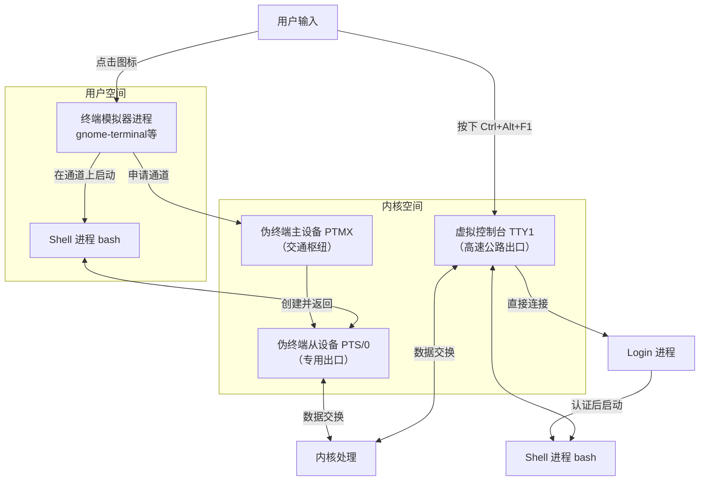

### 核心概念：tty 是什么？

​	**tty** 是 **Teletypewriter**（电传打字机）的缩写。这是一个古老的历史遗产，但在现代 Linux 系统中，它指的是一个**文本终端**（Text Terminal）。

​	你可以把它理解为一个 **“用户与系统进行文本交互的界面”**。每当你打开一个终端模拟器（如 GNOME Terminal、Konsole）、按 `Ctrl+Alt+F1~F6` 切换到虚拟控制台，或者通过 SSH 登录系统时，系统都会为你分配一个 tty。

---

### 1. 查看当前 tty

要查看你当前正在使用哪个 tty，非常简单，只需在终端中输入 `tty` 命令：

```bash
tty
```

它会返回类似这样的结果：
*   `/dev/tty1`：表示你位于第 1 个虚拟控制台。
*   `/dev/pts/0`：表示你位于第 0 个伪终端（最常见于桌面环境下的终端窗口或 SSH 连接）。

---

### 2. tty 的类型

在现代 Linux 系统中，你主要会遇到三种类型的 tty：

#### a) 物理终端 / 控制台终端
*   **路径：** `/dev/ttyn` (其中 `n` 是数字 1-6 或更多，例如 `/dev/tty1`, `/dev/tty2`)
*   **是什么：** 这是 Linux 系统启动后看到的直接界面。你可以通过按下 `Ctrl + Alt + F1` 到 `F6`（有时是 `F7`）来访问它们。它们是完全基于文本的，即使在图形界面（GUI）崩溃时也能正常工作，是系统救援的强大工具。
*   **历史：** 在过去，这对应着直接连接到计算机的物理终端设备。

#### b) 伪终端
*   **路径：** `/dev/pts/n` (其中 `n` 是数字，例如 `/dev/pts/0`, `/dev/pts/1`)
*   **是什么：** 这是**最常见**的类型。当你：
    *   在图形桌面环境（如 GNOME, KDE）中打开一个终端窗口。
    *   通过 SSH 或 Telnet 远程登录到系统。
    *   在终端里使用 `screen` 或 `tmux` 创建新窗口。
    系统都会为你创建一个伪终端 (`pts`)。它模拟了传统终端的行为，但背后没有真正的硬件，而是通过一个“主从设备对”与终端模拟器程序进行通信。

#### c) 串行终端
*   **路径：** `/dev/ttySn` (其中 `n` 是数字，例如 `/dev/ttyS0`)
*   **是什么：** 这对应着计算机的串行端口（如 COM1, COM2）。在过去，物理终端或调制解调器是通过串行线连接到计算机的。现在，它常用于连接硬件设备（如路由器、交换机的控制台端口）进行调试。

---

### 3. 相关命令和实用技巧

#### `who` 命令
查看当前系统中有哪些用户登录，以及他们使用的是哪个 tty。

```bash
who
```
输出示例：
```bash
user     tty1         2023-10-27 10:30
user     pts/0        2023-10-27 11:15 (192.168.1.100) # 来自SSH
user     pts/1        2023-10-27 11:20 (:0) # 来自本地图形界面的终端窗口
```

#### `w` 命令
比 `who` 更详细，显示了用户正在做什么（当前命令）。

```bash
w
```

#### 向其他 tty 发送消息
你可以使用 `write` 或 `wall` 命令向其他登录的用户发送消息。

*   **向特定用户发送消息：**
    
    ```bash
    write username pts/0
    ```
    然后输入你的消息，按 `Ctrl+D` 结束。对方就会在他的终端上看到你的消息。
    
    > **有要求**
    >
    > ​	**你的用户当前所在的“组”（Group ID/GID）”和你要发送消息的那个终端窗口（`/dev/pts/1`）的所有者组不匹配。**
    >
    > ​	Linux系统为了防止恶意骚扰，设计了一个规则：默认情况下，你只能给**同一个用户组**的终端发送消息。
    >
    > 1. **谁拥有 `/dev/pts/1`？**
    >    每个伪终端设备文件都有一个所有者和所属组。这通常是**创建这个终端的用户**及其**主要组**。
    >    你可以用 `ls -l` 命令查看：
    >
    >    ```bash
    >    ls -l /dev/pts/1
    >    ```
    >
    >    输出会类似：
    >
    >    ```bash
    >    crw--w---- 1 alice tty 136, 1 Oct 28 14:30 /dev/pts/1
    >    ```
    >
    >    - `alice`：文件所有者是用户 `alice`。
    >    - `tty`：文件所属的组是 `tty` 组。
    >
    >    **你的“有效组”是什么？**
    >    当你登录系统后，你除了有一个主要组（Primary Group），还可能属于很多附加组（Supplementary Groups）。你执行命令时，系统会有一个“有效组ID”（Effective GID）。
    >
    >    ```bash
    >    uid=1000(bob) gid=1000(bob) groups=1000(bob), 4(adm), 24(cdrom), 27(sudo), 30(dip), 46(plugdev), 122(lpadmin), 134(sambashare)
    >    ```
    >
    > 2. **矛盾发生了！**
    >
    >    - 你要写信的终端 `/dev/pts/1` 的组是 `tty`。
    >    - 你当前的有效组是 `bob`（或者你的用户名）。
    >    - `bob` ≠ `tty`，所以系统拒绝了你发送消息的请求，并给出了那个错误。
    
*   **向所有用户广播消息（需要 root 权限）：**
    
    ```bash
    sudo wall "系统将在5分钟后重启，请保存您的工作。"
    ```
    这条消息会出现在**所有**打开的终端（tty 和 pts）上。

#### `/dev/tty` 和 `/dev/console`
*   **`/dev/tty`**：这是一个特殊的文件，指向**当前进程**的控制终端。无论你是在 tty1 还是 pts/2，对你当前的 shell 来说，`/dev/tty` 就是指你“现在这个终端”。
*   **`/dev/console`**：通常指向系统的“主”终端，比如 `tty1`。它更常用于系统启动消息和内核消息。

---

### 为什么 tty 很重要？

1.  **用户会话管理：** 系统通过 tty 来管理多个并发的用户登录会话。
2.  **输入输出控制：** 每个 tty 都有自己的输入输出缓冲区和设置（如波特率，虽然现在不太重要）。
3.  **作业控制和信号：** 当你按 `Ctrl+C`（发送 SIGINT 信号）或 `Ctrl+Z`（发送 SIGTSTP 信号）时，这些信号是针对当前前台进程组的，而进程组是与特定的 tty 绑定的。这确保了信号只影响你当前终端中的程序，而不会影响其他终端里的程序。
4.  **权限和安全：** 文件 `/dev/tty1`, `/dev/pts/0` 等都有权限设置，决定了谁可以向它们读取或写入数据。

### 总结

| 类型           | 设备文件                       | 描述               | 常见场景                 |
| :------------- | :----------------------------- | :----------------- | :----------------------- |
| **虚拟控制台** | `/dev/tty1` ~ `/dev/tty6`      | 系统自带的文本界面 | `Ctrl+Alt+F1` ~ `F6`     |
| **伪终端**     | `/dev/pts/0`, `/dev/pts/1` ... | 模拟的终端         | 终端模拟器窗口、SSH 连接 |
| **串行终端**   | `/dev/ttyS0`, `/dev/ttyS1` ... | 通过串行端口连接   | 连接硬件设备控制台       |

简单来说，**tty 是 Linux 多用户、多任务文本界面的基石**。即使我们现在使用华丽的图形界面，其背后的终端窗口仍然通过“伪终端”与老祖宗“电传打字机”的概念保持着联系。

#### **最后出个流程图更清晰**


